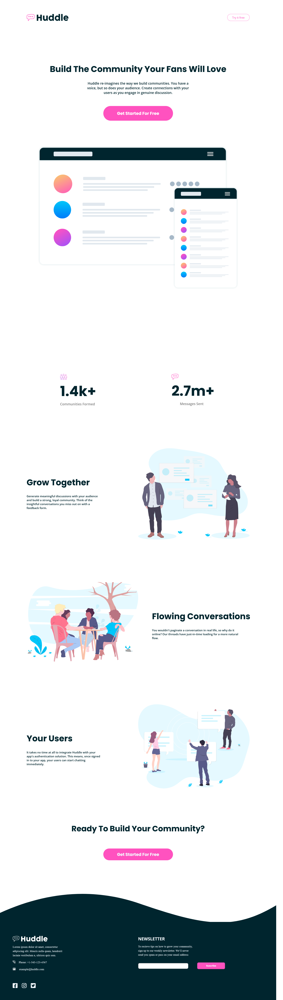

# huddle-page-curved


# Frontend Mentor - Huddle landing page with curved sections solution

This is a solution to the [Huddle landing page with curved sections challenge on Frontend Mentor](https://www.frontendmentor.io/challenges/huddle-landing-page-with-curved-sections-5ca5ecd01e82137ec91a50f2). Frontend Mentor challenges help you improve your coding skills by building realistic projects. 

## Table of contents


  - [The challenge](#the-challenge)
  - [Screenshot](#screenshot)
  - [Links](#links)
  - [Built with](#built-with)
  - [What I learned](#what-i-learned)
  - [Continued development](#continued-development)
  - [Useful resources](#useful-resources)
- [Author](#author)

### The challenge

Users should be able to:

- View the optimal layout for the site depending on their device's screen size
- See hover states for all interactive elements on the page

### Screenshot




### Links

- Solution URL: [Add solution URL here](https://github.com/informaticadiaz/huddle-page-curved)
- Live Site URL: [Add live site URL here](https://informaticadiaz.github.io/huddle-page-curved/)


### Built with

- Semantic HTML5 markup
- CSS custom properties
- Flexbox
- CSS Grid
- BEM
- Mobile-first workflow

### What I learned


```BEM
Learn BEM
```
```css
Learn Flexbox
```
```css
Learn Grid
```
```css
Learn Grid
start sass
```
```SASS
Start SASS? 
```

### Continued development

mockup html css

use BEM

Start SASS

Learn Javascript


## Author

- Website - [Diaz Ignacio](https://www.diazignacio.ar)
- Frontend Mentor - [@informaticadiaz](https://www.frontendmentor.io/profile/informaticadiaz)
- Twitter - [@DiazIgnacioDev](https://twitter.com/DiazIgnacioDev)
